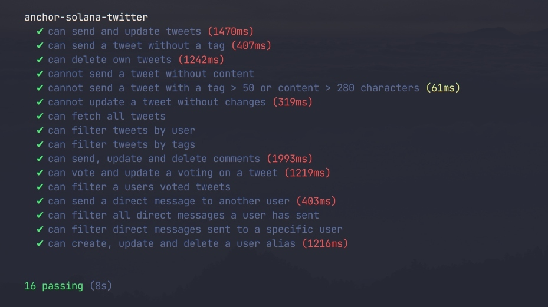

# anchor-solana-twitter

Aims to update, refactor and extend the v1-branch.

## Major changes

-  New api syntax

   -  abandon deprecated `.rpc` in favor of `.methods` syntax

-  Votings are accounts, instead of just updating a counter on an existing tweet

   -  enables filtering votings by users
   -  less costs for sending a vote
   -  `rating` counter on the tweet becomes obsolete

-  Direct messages are separate accounts instead of being a tweet

   -  less cost on for dms
   -  `recipient` on tweet account becomes obsolete

-  Comment functionality

-  Users can create aliases

## Tests

The installation of the prerequisites to run an anchor program is nicely explained in the [anchor book][1].

Having the prerequisites out of the way `yarn install` will load some program dependencies.

To run the tests change the destination of the [provider] wallet in `Anchor.toml` according to your systems configuration.

Building and running the test happens with `anchor test`.

To use the tests while working on a frontend run the localnet with `anchor localnet`. 
In another terminal airdrop your wallet some sol and load the test `solana airdrop 1000 <YourPhantomWalletPubKey> && anchor run test`.

[1]: https://book.anchor-lang.com/getting_started/installation.html
